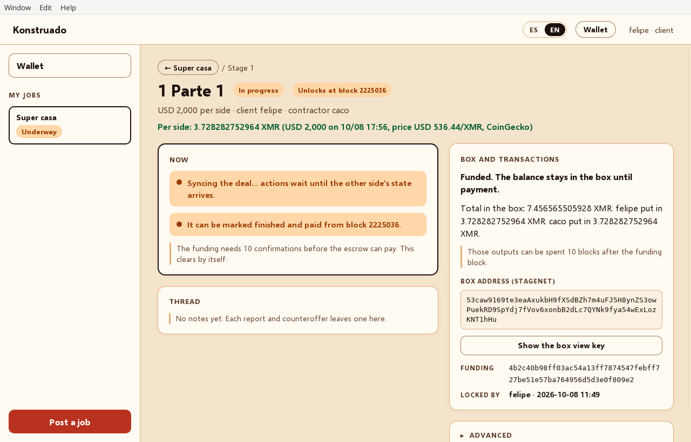

# Konstruado

**Pay a construction job stage by stage from a 2-of-2 FROST Monero box, peer to peer over Tor.**

> **Proof of concept. STAGENET ONLY. Not audited. Do not use real funds.**

> **Built with AI assistance.** Most of the code in this repository was written by an AI assistant under the direction of Felipe Brunet, who specified, reviewed and tested it. Treat it accordingly and review before trusting it.

## The problem

A client hires a contractor for a job paid in milestones. Today one side has to trust the other: the client pays up front, or the contractor works on credit. Konstruado puts each milestone (stage) into a Monero box that neither side can spend alone. For every stage both put in the same guarantee; when the work is done they agree on a percent, both co-sign, and the box pays out. No escrow agent, no server, no account.

## How it works

- **Rust core.** Deal state machine, merge rules and the box logic are shared Rust crates (`konstruado-core`, `konstruado-net`, `konstruado-motor`, `xmr-joint`, on top of a patched vendored [monero-oxide](third_party/monero-oxide)).
- **Desktop app** in [Dioxus](https://dioxuslabs.com/) (Linux). It bundles `tor` and hosts the meeting room.
- **Android app** in Jetpack Compose, calling the same Rust through [UniFFI](https://mozilla.github.io/uniffi-rs/). Tor comes from Orbot.
- **Peers meet over Tor.** A hardcoded onion acts as the rendezvous ("sala"), so the two sides never exchange addresses; offers and deal state are gossiped and merged, notes are sealed for the two parties.
- **One 2-of-2 FROST box per job.** A DKG between the two apps yields an ordinary stagenet address whose spend key exists only as two shares. Funding and payout are CLSAG transactions co-signed by both.
- **Priced in USD, fixed in XMR at funding.** Amounts are entered in USD; each stage's XMR is fixed with a reference price (CoinGecko, Kraken fallback) when it is locked, and both sides fund exactly that.

Details: [docs/ARCHITECTURE.md](docs/ARCHITECTURE.md) · [docs/PROTOCOL.md](docs/PROTOCOL.md).

## Try it on stagenet

1. Download from [Releases](https://github.com/felipebrunet/konstruado/releases): `konstruado-X.Y.Z-linux-x86_64` (desktop) and/or `konstruado-X.Y.Z-android-arm64.apk`. Check them against `SHA256SUMS`.
2. Desktop (Debian/Ubuntu): `sudo apt install tor libgtk-3-0 libwebkit2gtk-4.1-0 libxdo3`, then `chmod +x` and run the binary. The desktop of the client hosts the room, so keep one desktop open.
3. Android: install the APK and [Orbot](https://orbot.app/); in Konstruado **Account → Network** turn on **Use Orbot (SOCKS) and dial the room** (`127.0.0.1:9050`).
4. Each side creates its stagenet wallet (**Wallet**) and gets stagenet coins from a stagenet faucet, or from your own `monerod --stagenet` (set it under **Account → Monero node**). Coins need 10 blocks before they can be spent.
5. The client (**I pay for the job**) posts a job; the contractor (**I build it**) sees it on the board and accepts. Lock a stage, wait for the funding to unlock, report finish, accept and pay.

Two people on one PC: run the desktop twice with `KONSTRUADO_DATOS=dir1` and `KONSTRUADO_DATOS=dir2`. Both apps are in Spanish or English (**ES / EN**). Build from source: [docs/BUILDING.md](docs/BUILDING.md).

## Status

What is checked:

- `cargo test --workspace` (about 140 tests) and the Android JVM tests pass on every release: deal state and merge rules, offer withdrawal, the DKG (both sides derive the same address, shares restore), funding/payout split amounts, locally built and verified CLSAG transactions (including a tampered ring that must fail), English seed vs a known Monero vector, backup encryption and restore, Tor/Orbot diagnosis, the ES/EN texts.
- In-process network tests (no Tor): two nodes see each other's offers, a phone joins through a live session, two phones meet through the relay, the box messages go to the other side and not to the DHT.

What is **not** verified:

- No security audit of anything: the FROST/DKG integration, the CLSAG patches to monero-oxide, the message sealing, the backup format.
- Full stage funding and payout against the public stagenet network is not covered by automated tests; a live publish can still be rejected by the node.
- Tor itself is not exercised by the automated tests.
- The single hardcoded rendezvous onion is a central point that can be blocked.
- The USD reference price comes from centralized APIs.
- Android has been tried on few devices.

## Feedback wanted

- **Protocol review:** the 2-of-2 FROST DKG and co-signing flow, the stage split, the unlock gate, the rendezvous design. See [docs/PROTOCOL.md](docs/PROTOCOL.md).
- **Testers** on stagenet, desktop and Android: open an [issue](https://github.com/felipebrunet/konstruado/issues) with what broke.

## More

- [docs/BUILDING.md](docs/BUILDING.md): desktop, Android APK, Linux binary, icon.
- [docs/ARCHITECTURE.md](docs/ARCHITECTURE.md): crates, rendezvous, status of each piece, languages.
- [docs/PROTOCOL.md](docs/PROTOCOL.md): how Monero pays a stage, USD pricing, seed, full backup format, offer withdrawal.
- [docs/RELEASES.md](docs/RELEASES.md): versioning, release assets, signing, notable versions.
- [android/README.md](android/README.md): the Android app (Spanish).

*En español:* la app está en español e inglés; la documentación del Android está en [android/README.md](android/README.md).

## License

[MIT](LICENSE) © 2026 Felipe Brunet. Vendored third-party code keeps its own license (`third_party/`, `crates/xmr-joint/vendor/`). The GitHub mark is from [Octicons](https://github.com/primer/octicons) (MIT).
